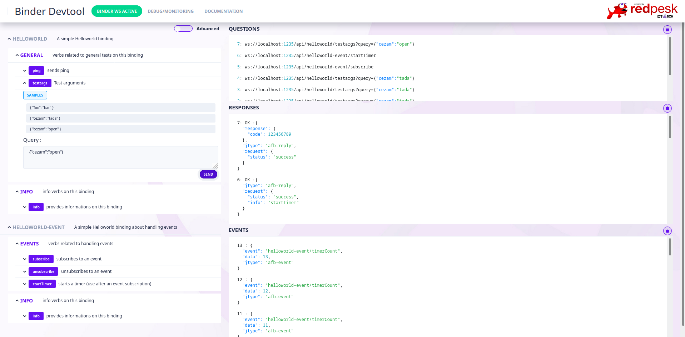
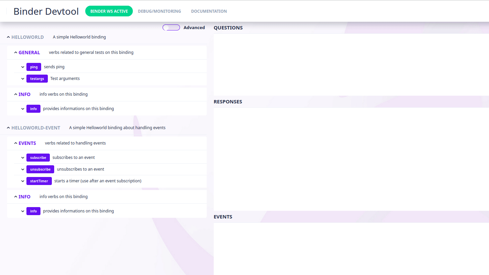

# Binder Devtool

The Binder devtool provides a graphical environment automatically populated to test the apis and verbs available on your binding.



## Native installation

First setup your host, declare redpesk native packages repository [refer to the add repository section]()

Then install the afb-ui-devtools package.

### for Fedora
```
sudo dnf install afb-ui-devtools
```

### for Debian
```
sudo apt-get install afb-ui-devtools
```

### for Ubuntu
```
sudo apt install afb-ui-devtools
```

### for OpenSUSE
```
sudo zypper install afb-ui-devtools
```

## Access Binder Devtool

Once a binding is running, to launch the Binder Devtool UI enter
`[host]:[port]/devtools/` in your browser address bar.

*For example: go on `localhost:30001/devtools/` to see UI Devtool of the helloworld binding running on localhost, on port 30001.*
*NOTE: Be sure your binding is running first and the port is correct.*
*NOTE: On Qemu, port forwarding could be used to access the webui devtool inside the qemu. See [Qemu section] for details.*

## Navigation Bar

**Binder WS Active / Disconnected** At the top of the UI, a green Binder WS Active button means that a binding is currently running on your environment and is accessible for testing and monitoring. In case of disconnection, the button turns to red and the verbs disappear. The UI will automatically attempt to reconnect itself.

**Debug/Monitoring** When binding runs on monitoring mode, this will open a new tab to the debug/monitoring interface.

## Apis and verbs

**General** Provides a selection of verbs sorted by groups with additional information such as status, actions and samples. See [Info verb usage](#info-verb-usage)
**Advanced** Displays all verbs available by api accessible by the running binding. Advanced is the default mode if General is not available.



## Testing a verb

Click on a verb to show its testing form. On **General mode**, clicking on some samples or actions, if provided, will directly pre-fill the query input with parameters. It is possible to modify the query before clicking on send. Sending an empty query is possible, however queries have to be formatted in json with "".

## Monitoring

**Questions** Displays the list of calls sent to apis.
**Responses** Displays the apis responses to the requests above.
**Events** Displays data sent by the apis from events subscribed to.

>*Note*: these three boxes are clearable by clicking on the bin icon on their top-left corner.

## Info verb usage

Verbs displayed in General mode are based on the running apis info verbs. Info verbs are structured as such:

```json
 "metadata": {
      "uid": "helloworld", // string => api name
      "info": "A simple Helloworld binding", // string => api description/info
      "status": {"online": true}, // object where to store additional infos such as uri, online, ...
      "version": "1.0"
    },
    "groups": [ // array of objects => list of groups
      {
        "uid":  "general", // string => group name
        "info": "verbs related to general tests on this binding",// string => group description/info
        "status": {"slaveid": 1}, // object where to store additional infos such as uri, online, ...
        "verbs": [ // array of objects => list of verbs belonging to this group
          {
            "uid": "ping", // string => verb name
            "info": "sends ping", // string => verb description
            "verb": "ping", // string => raw verb to be sent to the API
            "usage": { // object => query format will appear as a placeholder in the textarea to enter query
                "action": ["get","subscribe","unsubscribe"], // array of strings => list of actions such as Subscribe, Get, ...
                "data":{"data":"parameter"}, // object => hints on other parameter to add to the query can also be verbose, arg...
            },
            "sample":  [ // array of objects => list of samples
                {"foo":"bar"},
                {"cezam":"tada"},
                {"cezam":"open"}
            ]
          },
        ]
      },
    ]
  },
}
```


